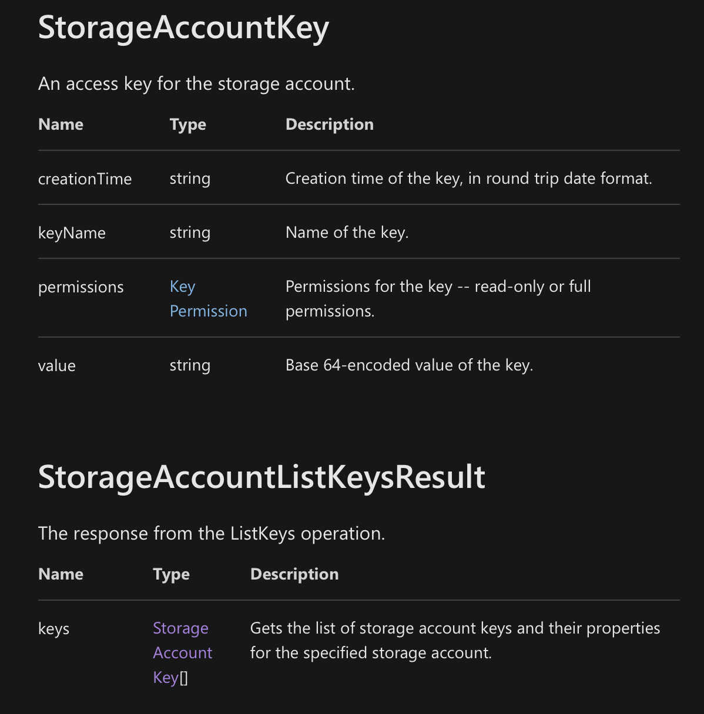

# Bicep

- [Discussion available at public bicep github](https://github.com/Azure/bicep)
- [Most recent community calls available at youtube](https://www.youtube.com/channel/UCZZ3-oMrVI5ssheMzaWC4uQ/videos)


## Bicep resource functions

- [Resource functions for Bicep](https://docs.microsoft.com/en-us/azure/azure-resource-manager/bicep/bicep-functions-resource)

Above resource functions such as:
```
list
listKeys
listKeyValue
```
The actual result varies depending of the underlying resource. 

### Storage account

For example in-case of a storage account, the access is in following format.
```
listKeys(resourceId, apiVersion).keys[0].value
```
Note the response format `keys[0].value` used with the `listKeys` function is based on the resource REST API response:



### Azure PubSub service


To store these secrets into keyvault:

```
resource pubSubConnectionString 'Microsoft.KeyVault/vaults/secrets@2019-09-01' = if (!empty(naming.webPubSub)) {
  name: '${keyVault.name}/AzurePubSub--ConnectionString'
  properties: {
    value: listKeys(resourceId('Microsoft.SignalRService/WebPubSub', naming.webPubSub), '2021-09-01-preview').primaryConnectionString
  }
}

resource pubSubPrimaryKey 'Microsoft.KeyVault/vaults/secrets@2019-09-01' = if (!empty(naming.webPubSub)) {
  name: '${keyVault.name}/AzurePubSub--PrimaryKey'
  properties: {
    value: listKeys(resourceId('Microsoft.SignalRService/WebPubSub', naming.webPubSub), '2021-09-01-preview').primaryKey
  }
}

