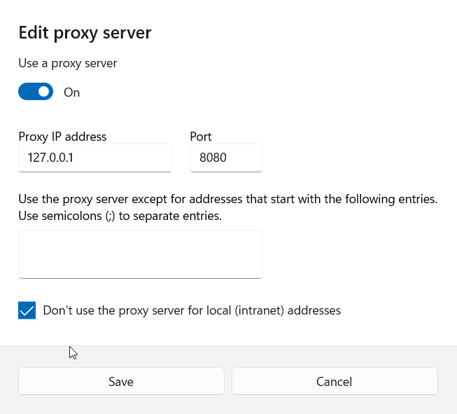
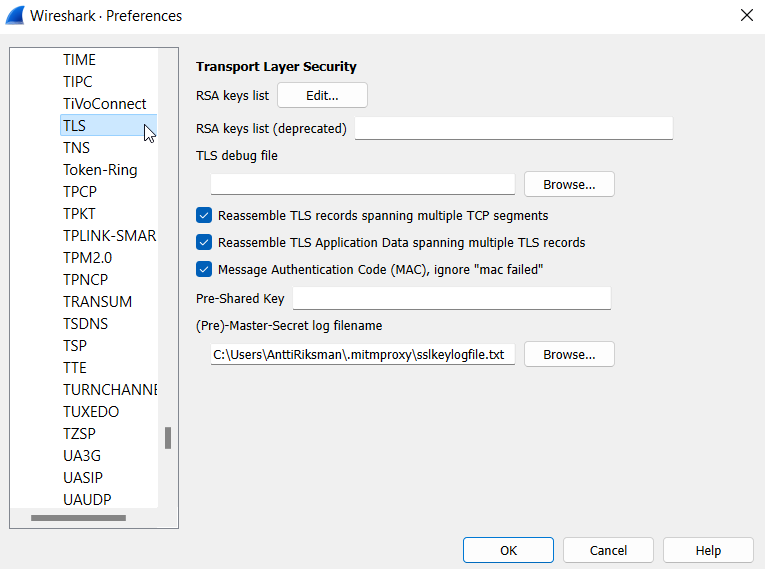
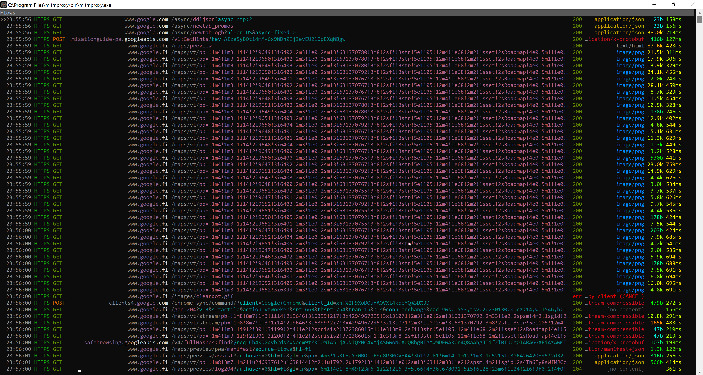
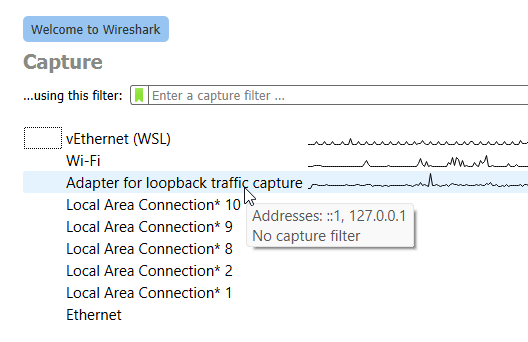
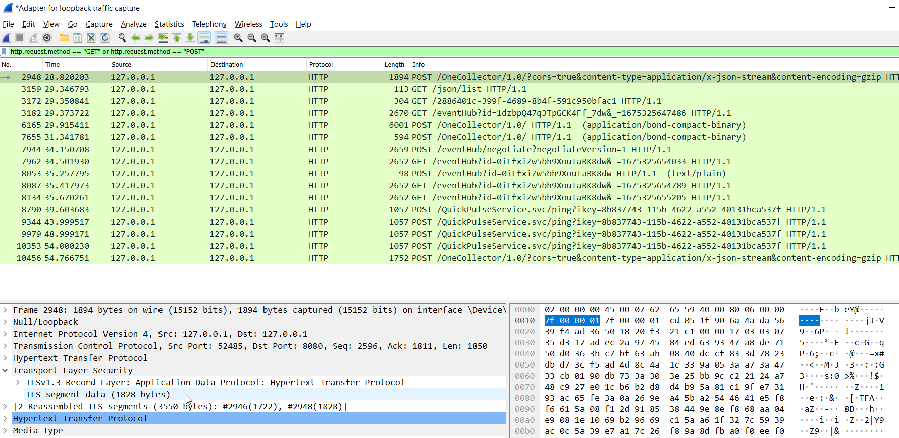

# Inspecting traffic with Wireshark + Mitmproxy

After installation of both Mitmproxy and wireshark, its easy to setup the startup with environmental variables via script. Save the following code snippet for example as `start_mitmproxy.cmd` on desktop folder.

```shell
@echo off
set MITMPROXY_SSLKEYLOGFILE=C:\Users\{UserName}\.mitmproxy\sslkeylogfile.txt
start mitmproxy
```
The documentation for the certificate process is available at: https://docs.mitmproxy.org/stable/overview-getting-started/

After certificate setup is ready configure Windows to use proxy at `127.0.0.1:8080`



After this, setup Wireshark TLS settings to use the same `sslkeylogfile.txt` for decrypting the traffic.



View of the proxy window



To start listening the `127.0.0.1` with wireshark, select right interface at the startup



And if everything is configured correctly, all traffic should be visible in the wireshark



## Wireshark filtering

Usefull filtering methods for wireshark:

```
http.host == "*.azure-api.net"
http.request.method == "GET" or http.request.method == "POST"
```
